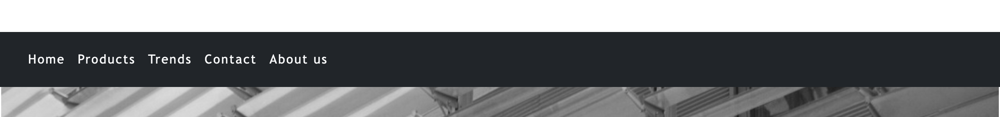
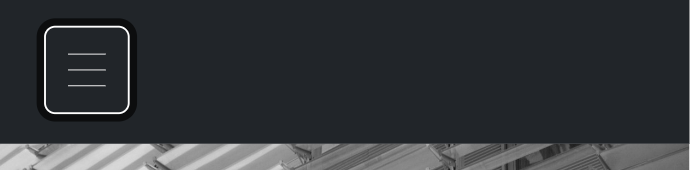
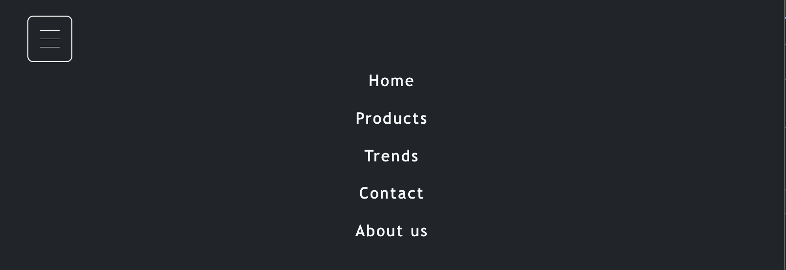
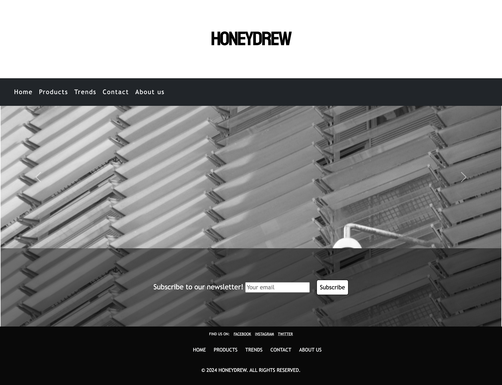

# *HONEYDREW*

The Honeydrew website allows visitors to explore our latest clothing collections and learn more about our brand. You can browse through stylish outfits, get the latest updates on new arrivals, and easily make pre-orders online. Visitors can quickly get in touch with us for customer support, inquiries
Check out our website at the following [link] (https://github.com/agui2393/HoneyDrew)
---
# First Time Visitor Goals:
* As a First Time Visitor, I want to quickly understand the main purpose of the site, so I can learn more about Honeydrew and what makes its clothing unique.
* As a First Time Visitor, I want to easily navigate through the website, so I can find the clothing collections, pricing, and information about the brand.

## Returning Visitor Goals:
* As a Returning Visitor, I want to see new arrivals and seasonal collections, so I can stay updated on the latest fashion trends.
* As a Returning Visitor, I want to find detailed product descriptions, so I can make informed purchase decisions.
* As a Returning Visitor, I want an easy way to contact customer support, so I can get help with sizing, orders, or returns.
* As a Returning Visitor, I want to explore community and sustainability initiatives, so I can learn more about the brand’s values and how I can support them.
### Frequent Visitor Goals:
* As a Frequent Visitor, I want to receive updates on sales, discounts, and special promotions, so I don’t miss out on the best deals.
* As a Frequent Visitor, I want to be able to easily contact customer service for any issues with my orders, returns, or exchanges, so I can receive prompt assistance.

## Features

+ # Navigation
    - Positioned at the top of the page.
    - Contains navigation links on the left side:
      * Home: leads to the home where users can see some images of the brand and can subscribe to the newsletter.
      * Products: leads to the products page wher eusers can see all the products available to buy.
      * Trends: leads to the trends page where users can see last trends in two of the most important magazines of the fashion industry.
      * Contact: leads to the contact form page where users can fill out the form in order to get in touch with the company.
      * About us: leads to the home page where users can learn about the company HONEYDREW.
    - The links have animated hover effect.
    - The navigation is clear and easy to understand for the user.
    

    - The navigation bar is responsive:
        * On tablets and phone: navigation bar is implemented in a hamburguer on the left side.

    

        * When the hamburger menu is clicked, there is dropdown menu with the links in the same order.

    
    
    # Home Page

    - Represent: 
      
      * Showcase pictures of the company in a carrousel.
      * Invites people to join the newsletter to keep updated with last news.

    

---

    # Products Page
    
    - 

---

    # Trends Page
    
    - 

