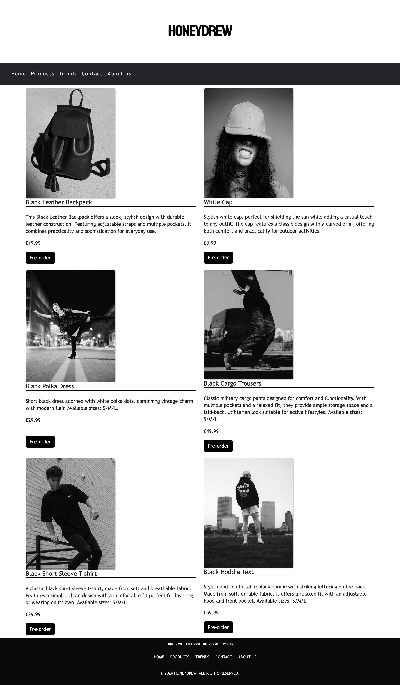
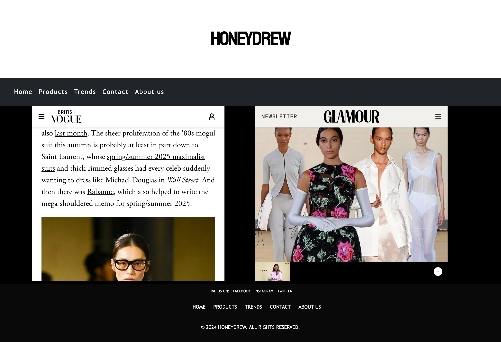
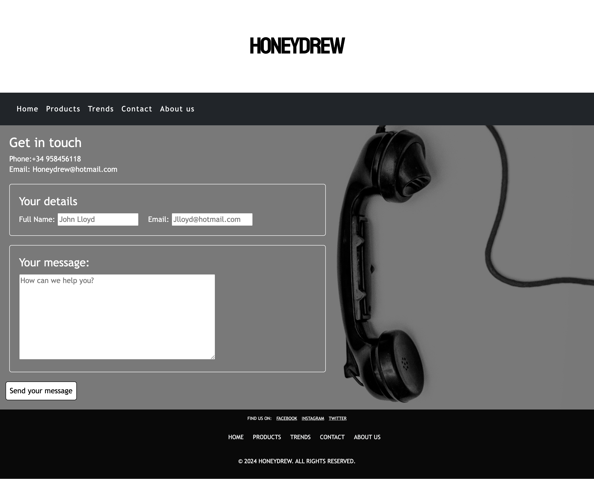
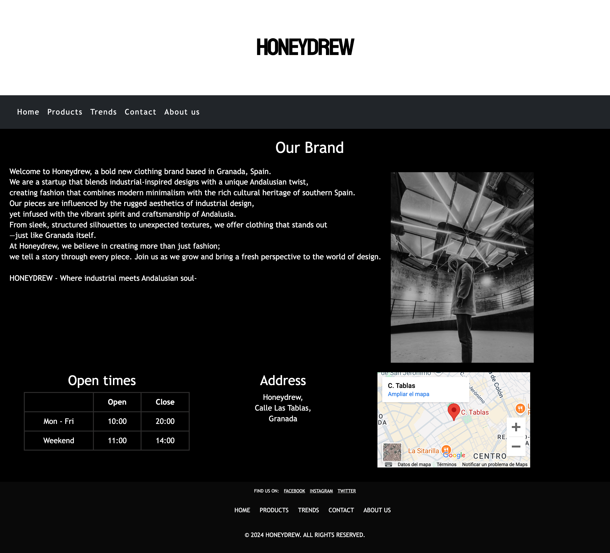
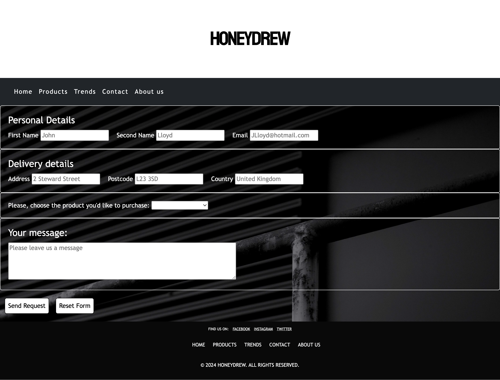
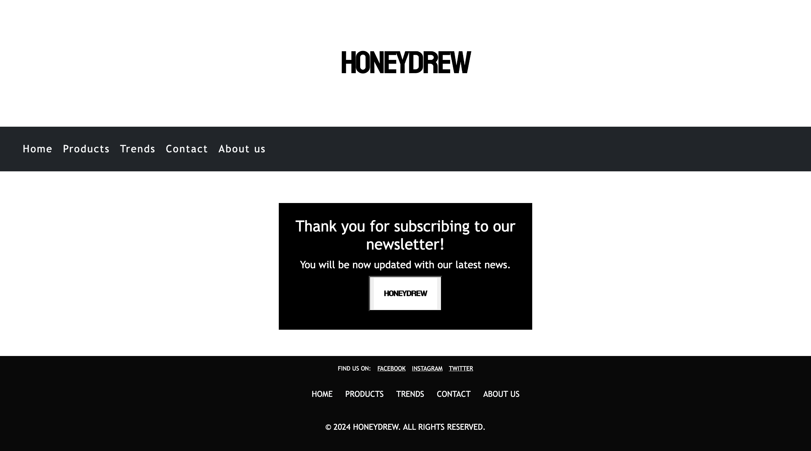
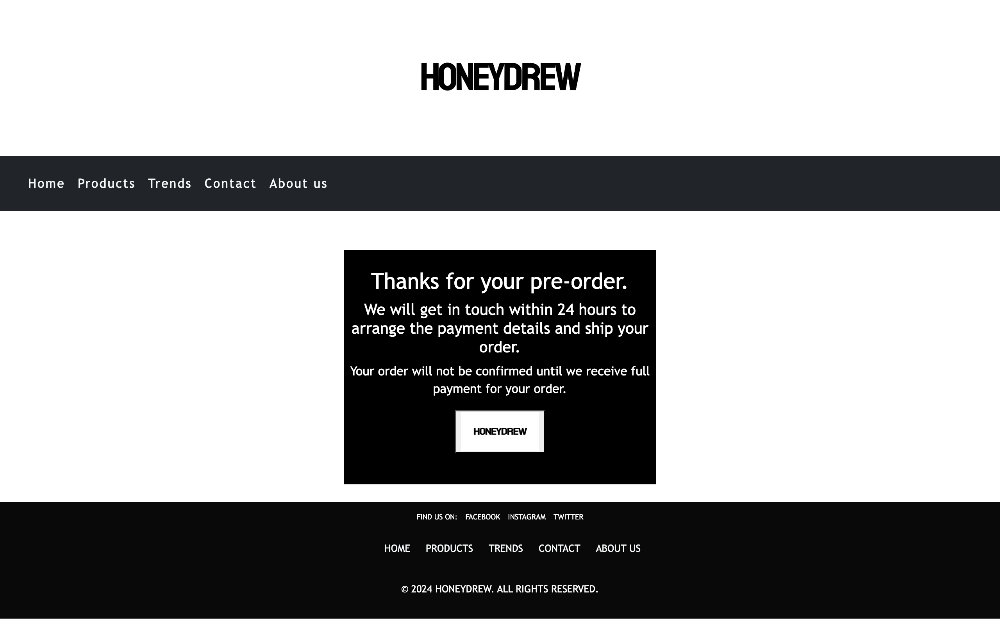
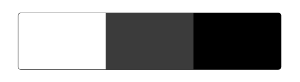

# *HONEYDREW*

The Honeydrew website allows visitors to explore our latest clothing collections and learn more about our brand. You can browse through stylish outfits, get the latest updates on new arrivals, and easily make pre-orders online. Visitors can quickly get in touch with us for customer support, inquiries
Check out our website at the following [link] (https://github.com/agui2393/HoneyDrew)
---
## First Time Visitor Goals:
* As a First Time Visitor, I want to quickly understand the main purpose of the site, so I can learn more about Honeydrew and what makes its clothing unique.
* As a First Time Visitor, I want to easily navigate through the website, so I can find the clothing collections, pricing, and information about the brand.

## Returning Visitor Goals:
* As a Returning Visitor, I want to see new arrivals and seasonal collections, so I can stay updated on the latest fashion trends.
* As a Returning Visitor, I want to find detailed product descriptions, so I can make informed purchase decisions.
* As a Returning Visitor, I want an easy way to contact customer support, so I can get help with sizing, orders, or returns.
* As a Returning Visitor, I want to explore community and sustainability initiatives, so I can learn more about the brand’s values and how I can support them.
## Frequent Visitor Goals:
* As a Frequent Visitor, I want to receive updates on sales, discounts, and special promotions, so I don’t miss out on the best deals.
* As a Frequent Visitor, I want to be able to easily contact customer service for any issues with my orders, returns, or exchanges, so I can receive prompt assistance.

# Features

+ ## Navigation bar
    - Positioned at the top of the page.
    - Contains navigation links on the left side:
      * Home: leads to the home where users can see some images of the brand and can subscribe to the newsletter.
      * Products: leads to the products page wher eusers can see all the products available to buy.
      * Trends: leads to the trends page where users can see last trends in two of the most important magazines of the fashion industry.
      * Contact: leads to the contact form page where users can fill out the form in order to get in touch with the company.
      * About us: leads to the home page where users can learn about the company HONEYDREW.
    - The links have animated hover effect.
    - The navigation is clear and easy to understand for the user.

    

    - The navigation bar is responsive:

    * On tablets and phone: navigation bar is implemented in a hamburguer on the left side.

    

    * When the hamburger menu is clicked, there is dropdown menu with the links in the same order.

    

+ ## Footer

    - Positioned at the bottom of the page contatins social media links in a new web.
    - Links has been added to the different sections of the website to make easier for users to go back to the other sections without having to scroll back to the top of the website.
    - Also copyright notice has been added into the footer area.

    

# Website Pages

## Home Page

   - Represent: 
    
   * Showcase pictures of the company in a carrousel.
   * Invites people to join the newsletter to keep updated with last news.
    

   

   * The newsletter area contains and imput area to type your email (this is a requiered field).
   * A "Subscribe" button has been added to submit your email  and will lead you to a new page with a "Thank you" message.

   

---

## Products Page
    
  - Product page has 6 cards with pictures of the items available to pre-order.
  - Heach card has name of the item, description and price of the item. 
  - Invites people to create a pre-order with a simple click on the button at the bottom of each card.
  - Pre-order button leads you to a new page where you can pre-oder the item.

---

## Trends Page
    
  - This page has two iframes conected to two fashion Websites: Vogue and Glamour.
  - Invite users to get to know more about fashion and help users to understand more about what to wear in the season.
  - User will know what is trendy to wear without having to leave our website. 

---

## Contact Page
    
  - Contact details of the company have been added: Email and Telephone number for users to get in touch.
  - Contains a contact form for users to imput their personal details and a message:
    - All text input fields are customized.
    - Placeholders have been added so user have an example of how to fill in the form.
    - All inputs are set to be required to fill out.
    - The submit button is animated on hover.
  - The page is responsive on all common screen sizes.
  - The submit button leads to the response page.
  - A background picuture have been added to make it more attractive.

---

## About us Page
    
  - About us page has a short description of the company's philosophy.
  - Apicture of the brand has been added to the right of the text.
  - An iframe with the maps location has been added to the bottom right corner to make easier for users to know the shop location.
  - Next to the iframe the Address has been added for more accesibility.
  - Contains a table with opening times of the shop.

---

## Pre-order Page

  - This page will appear after users click on the Pre-order button on the products page.
  - Contains a form: 
    - Imput areas has been added for users to imput personal details and delivery details. 
    - Dropdown box has been added to allow user to select the item they would like to buy. 
    - Contains a submit button that lead you to a response page and a reset button to clear the form.
  - All inputs are set to be required to fill out a exception of the text area as this is not a requirement.
  - The page is responsive on all common screen sizes.

  

---
## Response Pages

### Newsletter Response
  - Response page appears after submitting the subscrtion to the newsletter.
  - It contains the thank you message.
  - Below the message a button will lead to back to the Home Page.

  

### Pre-order Form Response

  - Response page appears after submitting the Pre-order form.
  - It contains the thank you message and the promise to get in touch within 24 hours regarding your pre-order.
  - It contains a message to inform users that orders will have to be paid before order is confirmed.
  - Below the message a button will lead to back to the Home Page.

  

### Contact Form Response
  - Response page appears after submitting the contact form.
  - It contains the thank you message and the promise to get in touch within 24 hours.
  - Below the message a button will lead to back to the Home Page.

  

---

# Technologies Used

- [HTML](https://developer.mozilla.org/en-US/docs/Web/HTML) was used as core structure of the site.
- [CSS](https://developer.mozilla.org/en-US/docs/Web/css) - was applied to style and arrange the layout of the website.
- [CSS Flexbox](https://developer.mozilla.org/en-US/docs/Learn/CSS/CSS_layout/Flexbox) - was used to position elements symmetrically across the pages.
- [CSS Grid](https://developer.mozilla.org/en-US/docs/Web/CSS/grid) - was employed to ensure the site is responsive on different screen sizes.
- [Canva](https://www.canva.com/en_gb/) was used to make wireframes for the website.
- [VSCode](https://code.visualstudio.com/) served as the primary code editor for writing and modifying the website's code.
- [Git](https://git-scm.com/) was used for the version control of the website.
- [GitHub](https://github.com/) was used to host the code of the website.
- [Bootstrap](https://getbootstrap.com/docs/5.3/getting-started/introduction/) was used to create and style navbar.

---

# Design

## Color Scheme

- The website uses a black, white, and grey color scheme for a clean, modern aesthetic and a professional look.
- Black is used for key design elements to evoke sophistication, elegance, and timelessness, reinforcing the brand's high-quality and fashionable identity.
- White serves as the primary background color, creating a clean, minimalistic look that allows the products to stand out while promoting a sense of freshness and simplicity.
- Grey is incorporated as a subtle accent color, adding depth and balance to the overall design without detracting from the brand's sleek, contemporary feel.

## Typography

- The Trebuchet MS font was used to give the Honeydrew brand a modern, clean, and approachable feel. It helps draw attention to key elements like the logo, highlights the brand's strengths, and encourages visitors to engage with the brand, whether through browsing collections or making a pre-order.

---

# Wireframes

- The wireframe for the Honeydrew website was designed to map out the structure and layout of key pages before development. It provides a visual representation of the website’s design elements, including navigation, content placement, and user interface (UI) components.

- You can view and download the wireframe in PDF format from the link below:

  

- The wireframe serves as a blueprint for the site, ensuring that the user experience (UX) is intuitive and well-organized. It helped guide the design process, ensuring that the layout aligned with the brand's goals and user needs. Some change were done since create the wire frame to make a better UX experience such as adding the bottom link to the website pages.