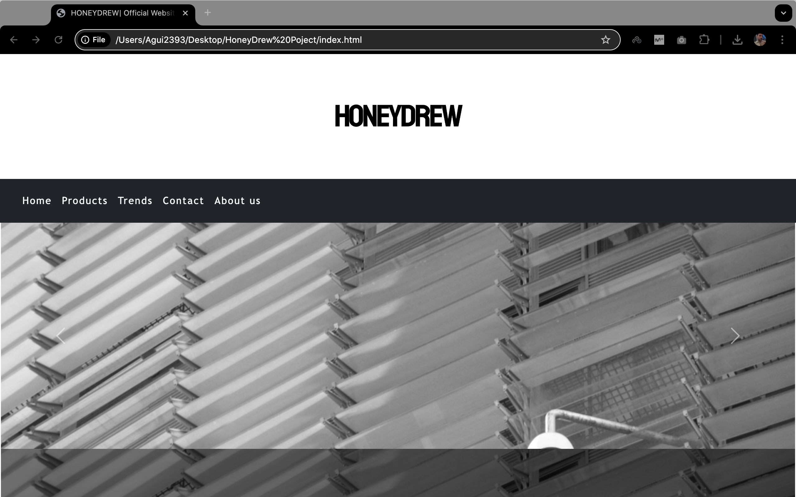
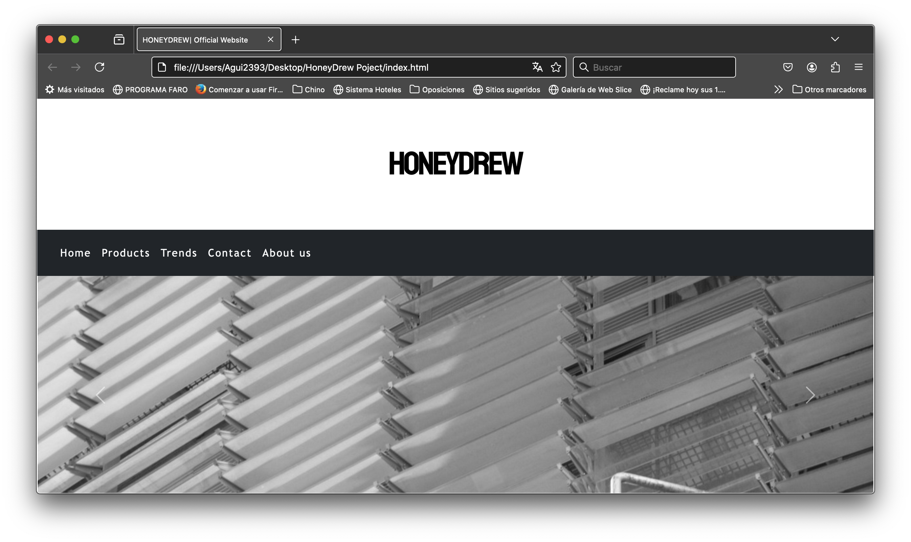
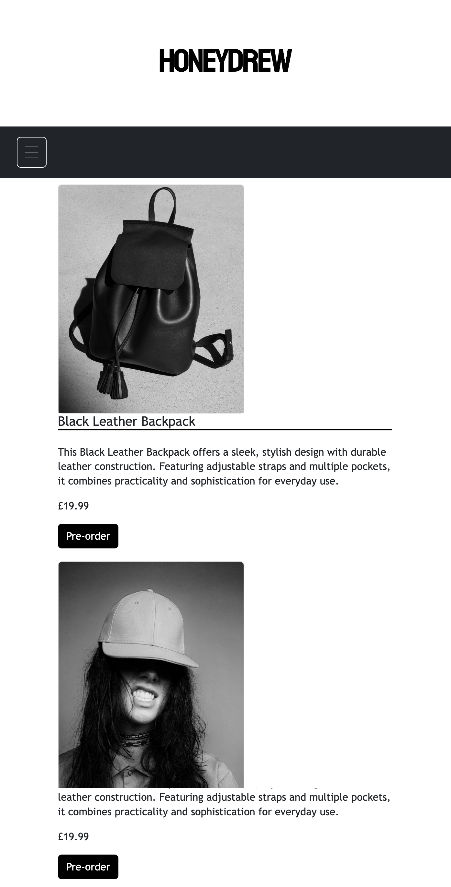
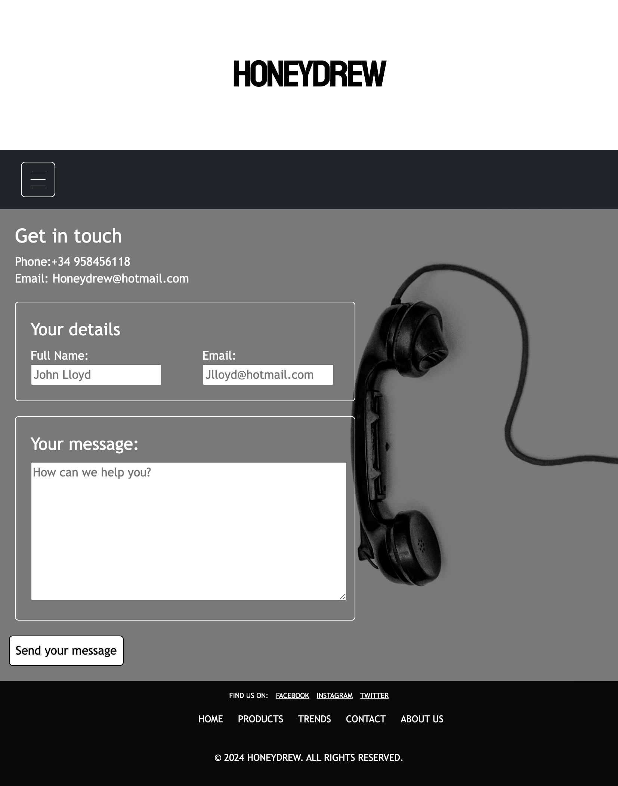
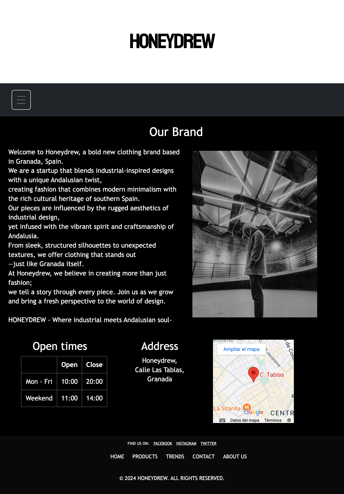
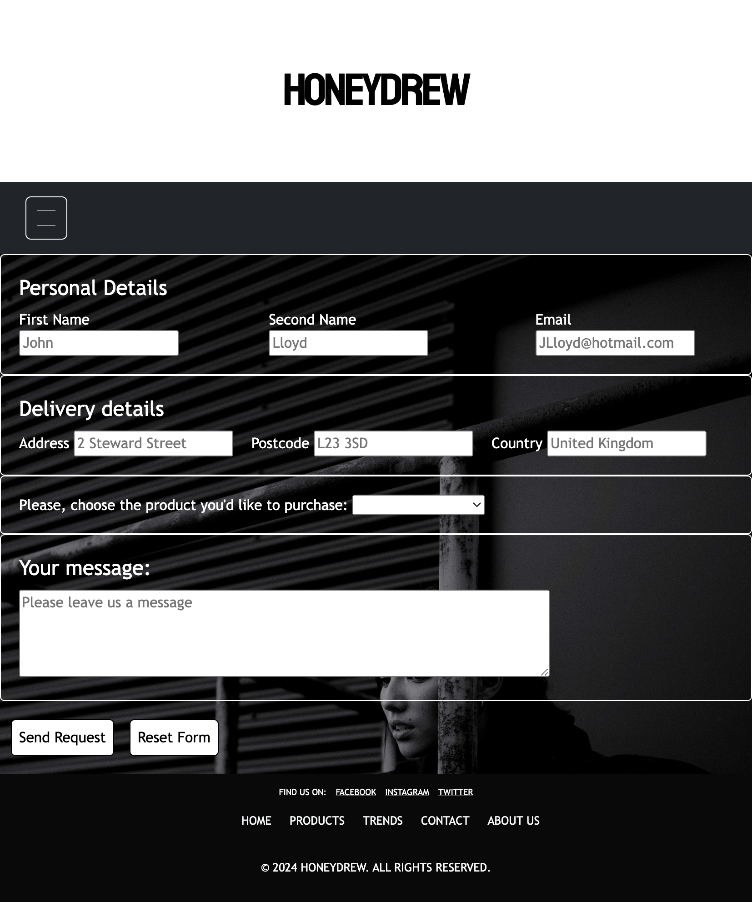
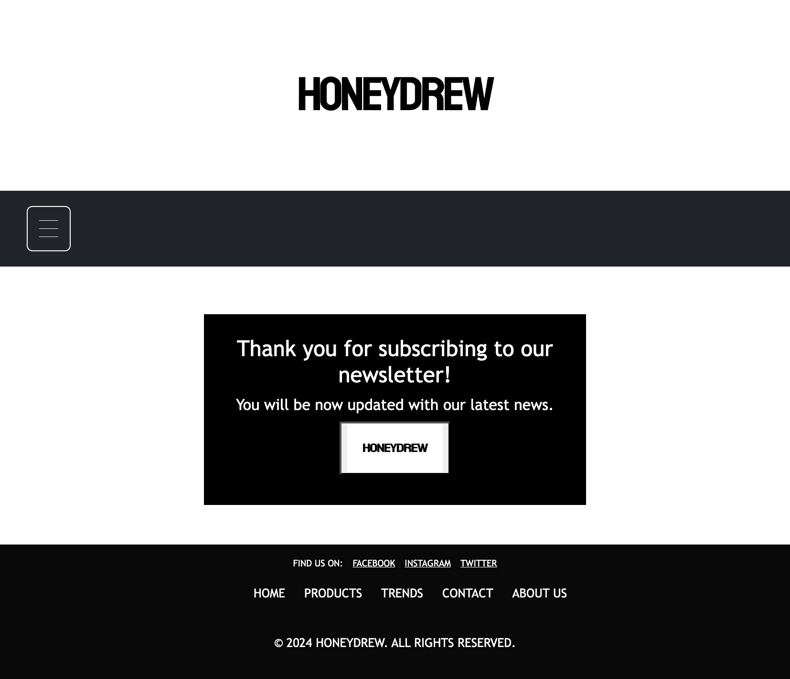
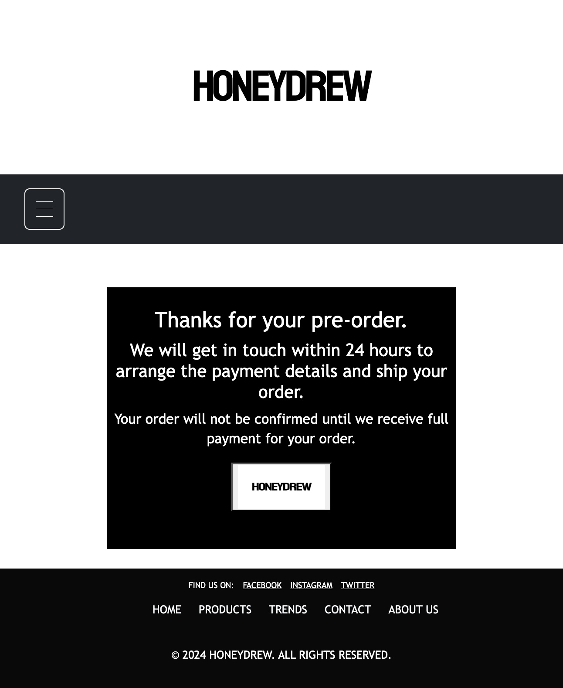
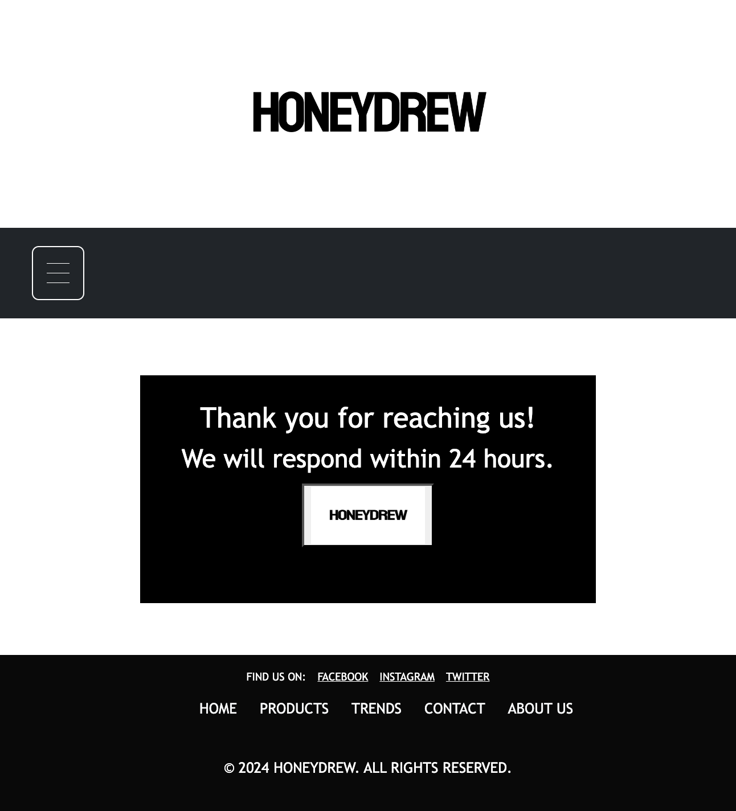
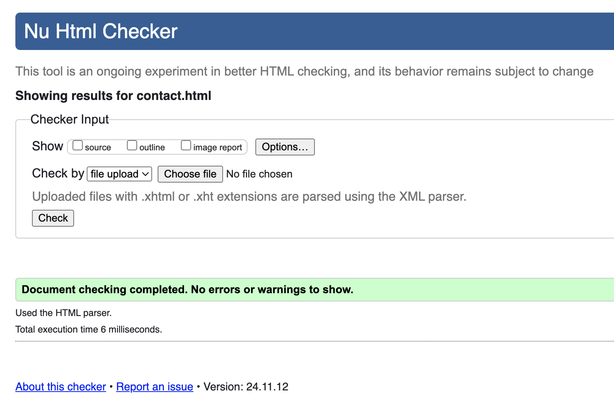

# TESTING

## Compatibility

In order to confirm the correct functionality, responsiveness, and appearance:

+ The website was tested on the following browsers: Chrome, Firefox, Safari.
    - Chrome:

    

    - FireFox:

    

    - Safari:

    

## Responsiveness

+ The website was checked by devtools implemented in Firefox and Chrome browsers.

    - Home Page:

    

    - Products Page:

    

    - Trends Page:

    

    - Contact Page:

    

    - About us Page:

    

    - Pre-oder Page:

    

    - Response Newsletter Page:

    

    - Response Pre-orders Page:

    

    - Response Contact:

    

+ The functionality of the links in the website was checked as well by different users.

## Manual testing

| Feature | Action | Expected result | Tested | Passed | Comments |
| --- | --- | --- | --- | --- | --- |
| Navbar | | | | | |
| Home | Click on the "Home" link | The user is redirected to the main page | Yes | Yes | - |
| Products | Click on the "Products" link | The user is redirected to the products page | Yes | Yes | - |
| Trends | Click on the "Trends" link | The user is redirected to the trends page | Yes | Yes | - |
| Contact | Click on the "Contact" link | The user is redirected to the contact page | Yes | Yes | - |
| About us | Click on the "About us" link | The user is redirected to the about us page | Yes | Yes | - |
| Footer | | | | | |
| Home | Click on the "Home" link | The user is redirected to the main page | Yes | Yes | - |
| Products | Click on the "Products" link | The user is redirected to the products page | Yes | Yes | - |
| Trends | Click on the "Trends" link | The user is redirected to the trends page | Yes | Yes | - |
| Contact | Click on the "Contact" link | The user is redirected to the contact page | Yes | Yes | - |
| About us | Click on the "About us" link | The user is redirected to the about us page | Yes | Yes | - |
| Instagram icon in the footer | Click on the Instagram icon | The user is redirected to the Instagram page | Yes | Yes | - |
| Facebook icon in the footer | Click on the Facebook icon | The user is redirected to the Facebook page | Yes | Yes | - |
| Twitter icon in the footer | Click on the Twitter icon | The user is redirected to the Twitter page | Yes | Yes | - |
| Home page | | | | | |
| Your email imput | Enter email | The email is entered | Yes | Yes |  If user doesn't enter the email, the error message appears |
| "Submit" button | Click on the "Submit" button | The user is redirected to the response page | Yes | Yes | - |
| Products page | | | | | |
| "Submit" button | Click on the "Pre-order" button | The user is redirected to the Preorder page | Yes | Yes | - |
| Pre-order page | | | | | |
| First name input | Enter the first name | The first name is entered | Yes | Yes | If user doesn't enter the first name, the error message appears |
| Second name input | Enter the second name | The second name is entered | Yes | Yes | If user doesn't enter the last name, the error message appears |
| Email input | Enter the email | The email is entered | Yes | Yes | If user doesn't enter the email, the error message appears. If user enters not valid email, the error message appears |
| Address input | Enter the Address | The Address is entered | Yes | Yes | If user doesn't enter the Address, the error message appears |
| Postcode input | Enter the Postcode | The Postcode is entered | Yes | Yes | If user doesn't enter the Postcode, the error message appears |
| Country input | Enter the Country | The Country is entered | Yes | Yes | If user doesn't enter the Country, the error message appears |
| Dropdown box | Choose one of the options | Option selected | Yes | Yes | If user doesn't choose an option, the error message appears |
| Text area | Enter text | text entered | Yes | Yes | - |
| "Submit" button | Click on the "Submit" button | The user is redirected to the response page | Yes | Yes | - |
| "Reset" button | Click on the "reset" button | Form is cleared | Yes | Yes | - |
| Contact page | | | | | |
| Full name input | Enter the full name | The full name is entered | Yes | Yes | If user doesn't enter the first name, the error message appears |
| Email input | Enter the email | The email is entered | Yes | Yes | If user doesn't enter the email, the error message appears. If user enters not valid email, the error message appears |
| Text area | Enter text | text entered | Yes | Yes |  If user doesn't enter the first name, the error message appears |
| "Send your message" button | Click on the "Send your message" button | The user is redirected to the response page | Yes | Yes | - |

# Validator testing

+ ## HTML

### Home Page

- No errors or warnings were found when passing through the official W3C validator.

    

### Products Page

- No errors or warnings were found when passing through the official W3C validator.

    

### Trends Page

- No errors or warnings were found when passing through the official W3C validator.

    

### Contact Page

- No errors or warnings were found when passing through the official W3C validator.

    

### About us Page

- No errors or warnings were found when passing through the official W3C validator.

    

### Respone Newsletter Page

- No errors or warnings were found when passing through the official W3C validator.

    
